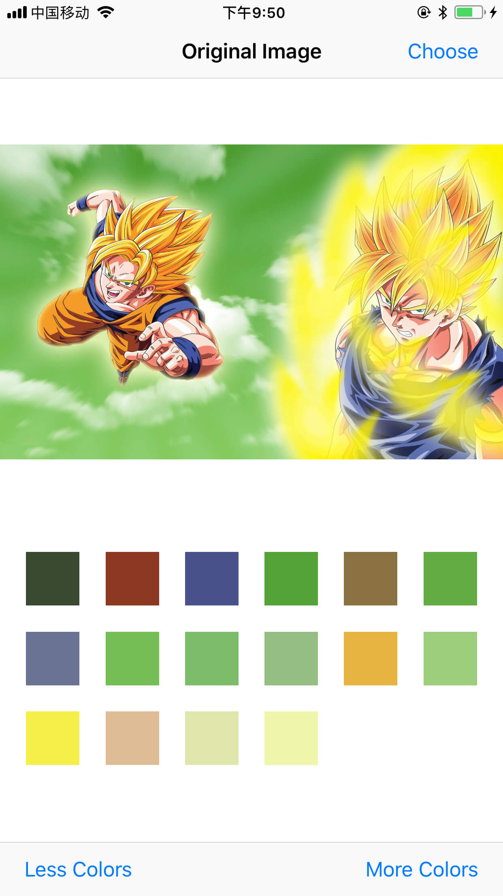
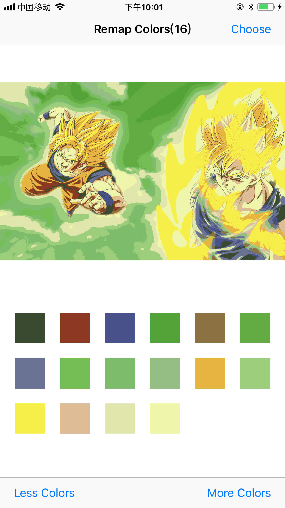

<h1>median_cut_palette</h1>

C++ 实现 [Median-Cut Color Quantization](http://collaboration.cmc.ec.gc.ca/science/rpn/biblio/ddj/Website/articles/DDJ/1994/9409/9409e/9409e.htm) 算法。这个算法输入一张图片，从图片中提取指定数量的颜色。

另外包含 iOS 的 Demo，界面如下。点击界面中大图，可以切换模式，只使用提取到的颜色，去替换其它颜色。

<figure class="half">

</figure>

